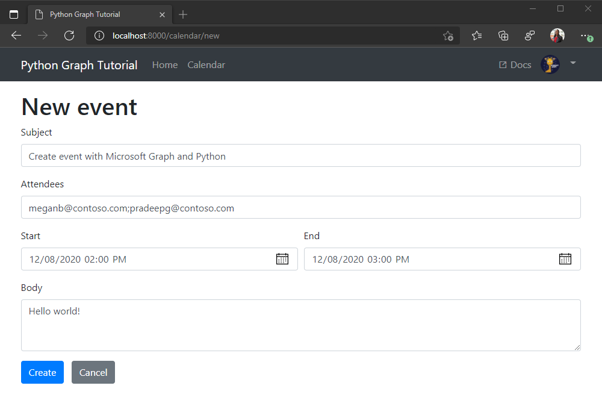

<!-- markdownlint-disable MD002 MD041 -->

<span data-ttu-id="8520c-101">在此部分中，您将添加在用户日历上创建事件的能力。</span><span class="sxs-lookup"><span data-stu-id="8520c-101">In this section you will add the ability to create events on the user's calendar.</span></span>

1. <span data-ttu-id="8520c-102">将以下方法添加到 **./tutorial/graph_helper.py** 以创建新事件。</span><span class="sxs-lookup"><span data-stu-id="8520c-102">Add the following method to **./tutorial/graph_helper.py** to create a new event.</span></span>

    :::code language="python" source="../demo/graph_tutorial/tutorial/graph_helper.py" id="CreateEventSnippet":::

## <a name="create-a-new-event-form"></a><span data-ttu-id="8520c-103">创建新的事件表单</span><span class="sxs-lookup"><span data-stu-id="8520c-103">Create a new event form</span></span>

1. <span data-ttu-id="8520c-104">在 **./tutorial/templates/tutorial** 目录中创建一个名为的新文件 `newevent.html` ，并添加以下代码。</span><span class="sxs-lookup"><span data-stu-id="8520c-104">Create a new file in the **./tutorial/templates/tutorial** directory named `newevent.html` and add the following code.</span></span>

    :::code language="html" source="../demo/graph_tutorial/tutorial/templates/tutorial/newevent.html" id="NewEventSnippet":::

1. <span data-ttu-id="8520c-105">将以下视图添加到 **./tutorial/views.py**。</span><span class="sxs-lookup"><span data-stu-id="8520c-105">Add the following view to **./tutorial/views.py**.</span></span>

    :::code language="python" source="../demo/graph_tutorial/tutorial/views.py" id="NewEventViewSnippet":::

1. <span data-ttu-id="8520c-106">打开 **./tutorial/urls.py，** 然后为 `path` 视图添加 `newevent` 语句。</span><span class="sxs-lookup"><span data-stu-id="8520c-106">Open **./tutorial/urls.py** and add a `path` statements for the `newevent` view.</span></span>

    ```python
    path('calendar/new', views.newevent, name='newevent'),
    ```

1. <span data-ttu-id="8520c-107">保存更改并刷新应用。</span><span class="sxs-lookup"><span data-stu-id="8520c-107">Save your changes and refresh the app.</span></span> <span data-ttu-id="8520c-108">在 **"日历** "页上，选择 **"新建事件"** 按钮。</span><span class="sxs-lookup"><span data-stu-id="8520c-108">On the **Calendar** page, select the **New event** button.</span></span> <span data-ttu-id="8520c-109">填写表单，然后选择" **创建** "以创建事件。</span><span class="sxs-lookup"><span data-stu-id="8520c-109">Fill in the form and select **Create** to create the event.</span></span>

    
